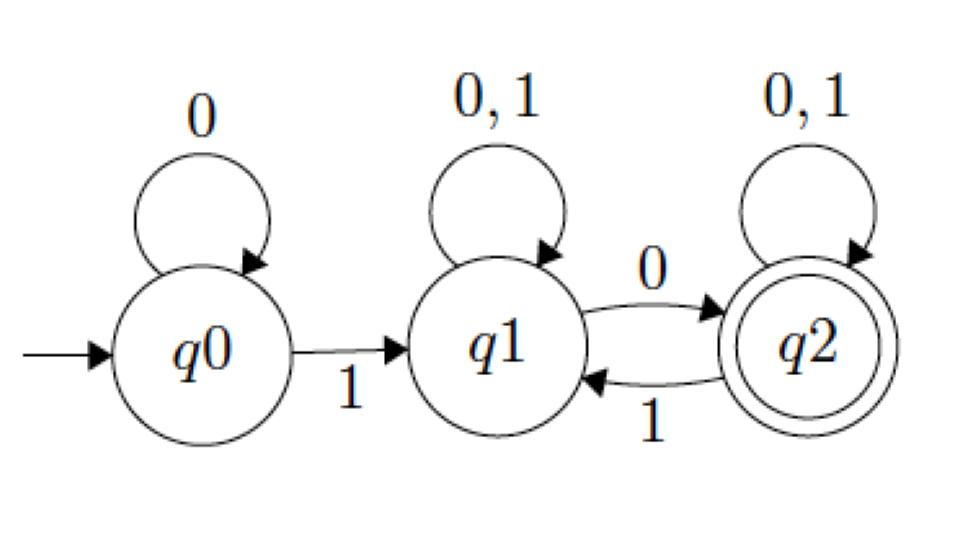

# Nondeterministic Finite Automata and the Pumping Lemma

## Due 10/6

## Overview

This is a short assignment to let you practice proofs using the Pumping Lemma and constructing NFAs.

The second part includes some tips and practice questions on preparing for the midterm, which will be on October 4. **You do not have to submit the review questions**.

## Pump

1. Consider the language *L* on {*a*, *b*} consisting of strings with the form *ww*, where *w* is any string of *a*'s and *b*'s. That is, *L* consists of strings formed from two consecutive identical copies of a substring of *a*'s and *b*'s. For example, *abab*, *abbaabba*, and *bbababbaba* are all in this language. Use the Pumping Lemma to prove that this language is not regular.

2. Prove that *L* = {0i 1j 0i + j; *i*, *j* ≥ 0} is not regular.

Tips:

- Use the script for Pumping Lemma proofs. You **do** need to write out the starting and ending paragraphs beacuse they're part of the proof. [The forms must be obeyed](https://dune.fandom.com/wiki/Great_Convention).

- Find one specific string *s* that has length at least *n* to use for your contradiction. It's not required, but helpful, if *s* starts with *n* copies of the same character.

- Once you've identified a candidate *s*, reason about the *x*, *y*, and *z* pieces required by the Lemma. See if you can establish restrictions on *y*.

- Then find one specific value of *m* that makes *x* *y**m* *z* not part of the language. This is the contradiction that you need to show that *s* cannot be pumped.

## Construction

Use the NFA construction algorithm to build machines that recognize the following regular expressions. You don't have to perform any simplification of the resulting NFAs.

1. *a*\**b*\*

2. (*aa* | *bb*) (*ab* | *ba*)

3. *a* *b*\* *a* *b*\*

4. (*a*|*b*)\* | (*c*|*d*)\*

## Conversion

Convert the following NFA into an equivalent DFA.

Tips:

- Work step by step. Start by identiying the set of states, then all subsets of states.
- Determine which sets of states are starting and accepting.
- Then write down the NFA transition table.
- Use the NFA table to determine the transition table for the corresponding DFA.
- Draw out the full DFA model, then prune unused states.

# Exam Review

The exam will be 50 minutes and consist of 5-7 short answer questions. All questions will be worth the same number of points. Remember that, under the course grading system, you only need to earn a score above 80% to get full credit and above 60% to get partial credit.

You should be familiar with the following:

Logic stuff:

- Using truth tables to show that logical expressions are equivalent. In particular, make sure you can work with conditional and biconditional statements and the XOR operator.
- We did more background stuff on logic and sets, etc., but I don't plan to ask any questions about set notation, number formats, or the other topics from Assignment 1.

DFA stuff:

- Given a DFA, describe the set of strings it recognizes.
- Given a DFA, write its formal definition and transition table, and vice-versa.
- Given a regular language, draw out a DFA that recognizes that regular expression.

NFA stuff:

- Given an NFA, show that it does or does not accept a given input string.
- Construct an NFA from a regular expression using the mechanical approach.
- I **won't** ask you to do a NFA-to-DFA conversion on the exam.

Pumping Lemma:

- I **will not**  ask you to do a full proof on the exam.
- I *might* give you a description of a language and a candidate a string, then ask you to show how to divide that string into *x*, *y*, and *z* parts to show that it can be pumped.
- I also might give you a candidate string and ask you to give a contradiction showing that it can't be pumped.
